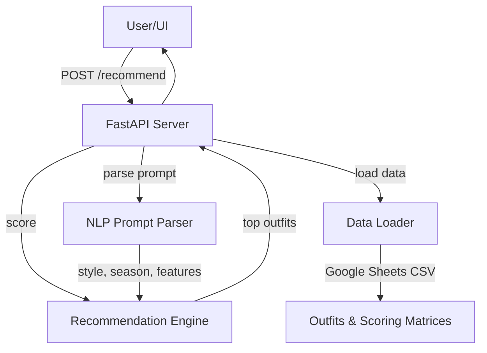

# Outfit Recommender API — Architecture


**Modules:**
- **main.py**: API endpoints, request/response handling
- **nlp_prompt_parser.py**: Extracts style/season/features from free text
- **data_loader.py**: Loads outfits, scoring rules from Google Sheets (CSV)
- **recommender.py, scoring.py**: Rule-based recommendation engine

# Rule-Based Scoring Flow
``` mermaid
    flowchart TD
    A[Start: Receive Outfit & User Preferences] --> B{Style Match >= Threshold?}
    B -- No --> Z[Exclude Outfit]
    B -- Yes --> C[Calculate Body Shape Score]
    C --> D{Body Shape Score < Threshold?}
    D -- Yes --> E[Apply Penalty to Body Shape Score]
    D -- No --> F[Keep Body Shape Score]
    E --> F
    F --> G[Calculate Occasion Score (weight x1.5)]
    G --> H[Calculate Season Score]
    H --> I{Season Score < Threshold?}
    I -- Yes --> J[Apply Small Penalty to Season Score]
    I -- No --> K[Keep Season Score]
    J --> K
    K --> L[Calculate Feature Match Bonus]
    L --> M[Combine Scores with Weights:
    - Style x3.0
    - Body Shape x2.0
    - Occasion x2.5
    - Season x1.5
    - Feature Bonus]
    M --> N[Assign Final Score to Outfit]
    N --> O[Repeat for All Outfits]
    O --> P[Sort Outfits by Final Score]
    P --> Q[Return Top-K Recommendations]
```