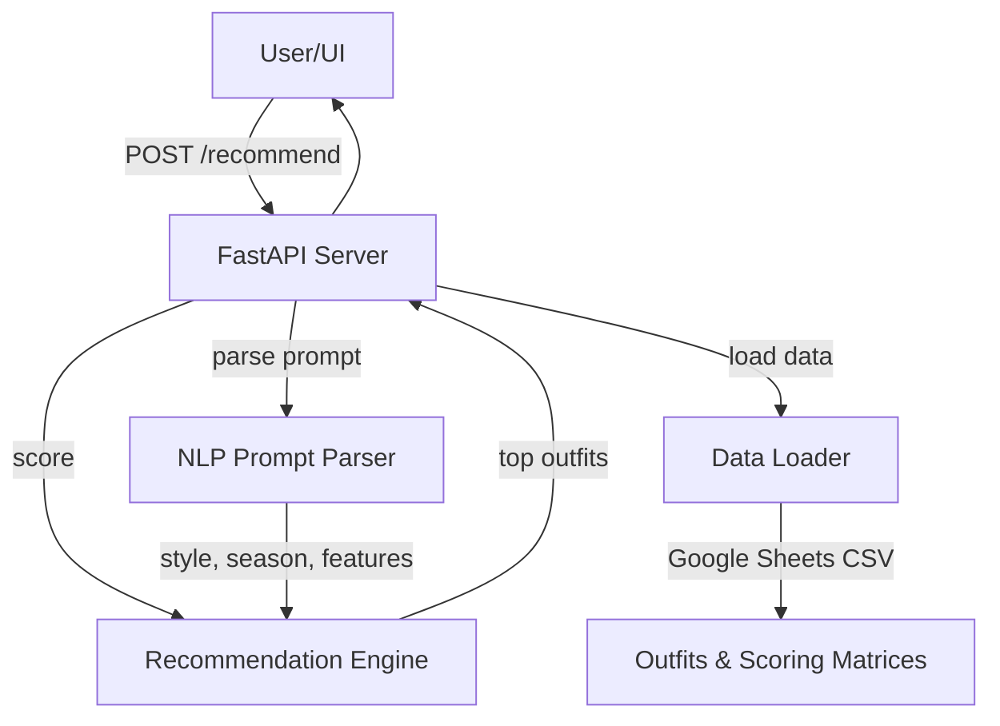

# Outfit Recommender API — Architecture

**Modules:**
- **main.py**: API endpoints, request/response handling
- **nlp_prompt_parser.py**: Extracts style/season/features from free text
- **data_loader.py**: Loads outfits, scoring rules from Google Sheets (CSV)
- **recommender.py, scoring.py**: Rule-based recommendation engine