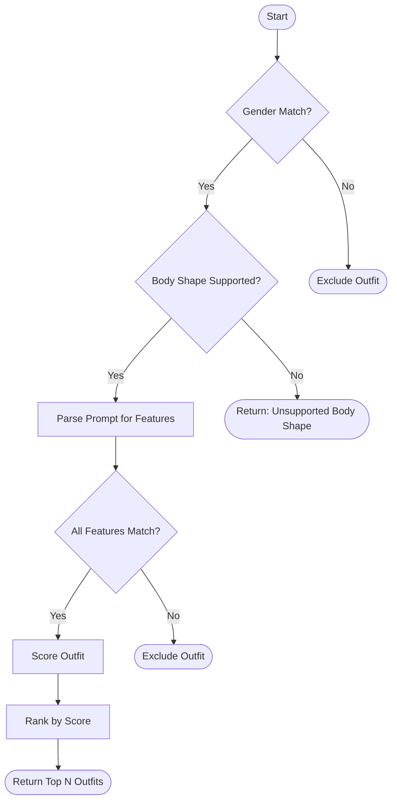

# Rule-Based Decision Tree — Expanded Story

This decision tree describes how the AI-Driven Outfit Recommender makes its choices using clear, step-by-step, rule-based (if-then) logic.

---

## Top-Level Decision Flow

### 1. **Gender Filtering (First Branch)**
- **IF** the outfit's gender matches the user's gender **OR** the outfit is unisex  
  → **then** include outfit, **else** exclude.

### 2. **Body Shape Filtering**  
- **IF** the user's body shape is in the supported list (Hourglass, Triangle, Inverted Triangle, Rectangle, Oval)  
  → **then** continue, **else** stop and return "unsupported body shape".

### 3. **Prompt Feature Extraction (AI Branch)**
- **IF** the user prompt contains keywords for style, season, occasion, or features  
  → **then** extract them, **else** set defaults (e.g., style = 'Casual').

### 4. **Feature Matching**
- **IF** extracted features are present  
  - For each required feature (e.g., "short sleeve", "cotton"):  
    - **IF** the outfit's attribute matches the feature  
      → **then** continue, **else** exclude outfit.

### 5. **Scoring Branch**
- **IF** outfit passes all above filters  
  → **then** calculate:  
    - Style Score (rule-based, using style matrix)  
    - Body Shape Score (rule-based, using body shape matrix)  
    - Season Score (heuristic)  
    - Occasion Score (heuristic)  
    - Sum for Total Score

### 6. **Ranking and Return**
- **IF** more than one outfit remains  
  → **then** rank by Total Score, return top N.  
- **ELSE**  
  → return a message: "No suitable outfits found."

---

## Visual Decision Tree



## Detailed Scoring Flow
```mermaid
flowchart TD
    A[Start: Receive Outfit & User Preferences] --> B{Style Match >= Threshold?}
    B -- No --> Z[Exclude Outfit]
    B -- Yes --> C[Calculate Body Shape Score]
    C --> D{Body Shape Score < Threshold?}
    D -- Yes --> E[Apply Penalty to Body Shape Score]
    D -- No --> F[Keep Body Shape Score]
    E --> F
    F --> G[Calculate Occasion Score with Weight 1.5]
    G --> H[Calculate Season Score]
    H --> I{Season Score < Threshold?}
    I -- Yes --> J[Apply Small Penalty to Season Score]
    I -- No --> K[Keep Season Score]
    J --> K
    K --> L[Calculate Feature Match Bonus]
    L --> M[Combine Scores with Weights<br>Style x3.0<br>Body Shape x2.0<br>Occasion x2.5<br>Season x1.5<br>Feature Bonus]
    M --> N[Assign Final Score to Outfit]
    N --> O[Repeat for All Outfits]
    O --> P[Sort Outfits by Final Score]
    P --> Q[Return Top-K Recommendations]
